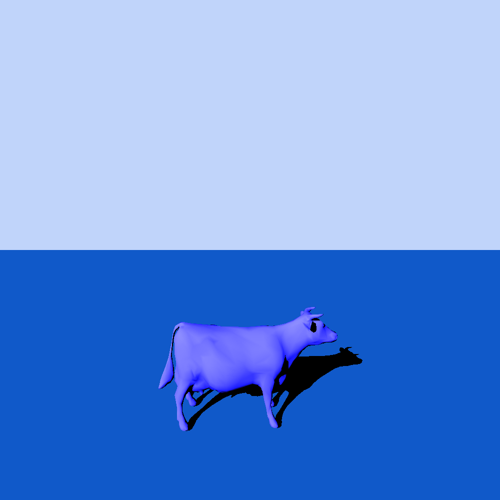
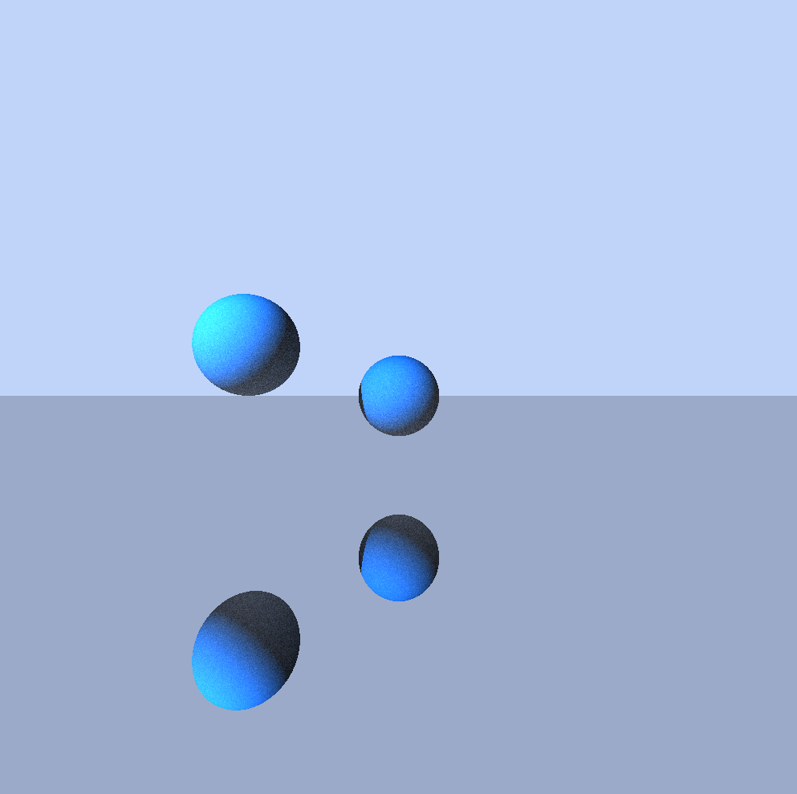
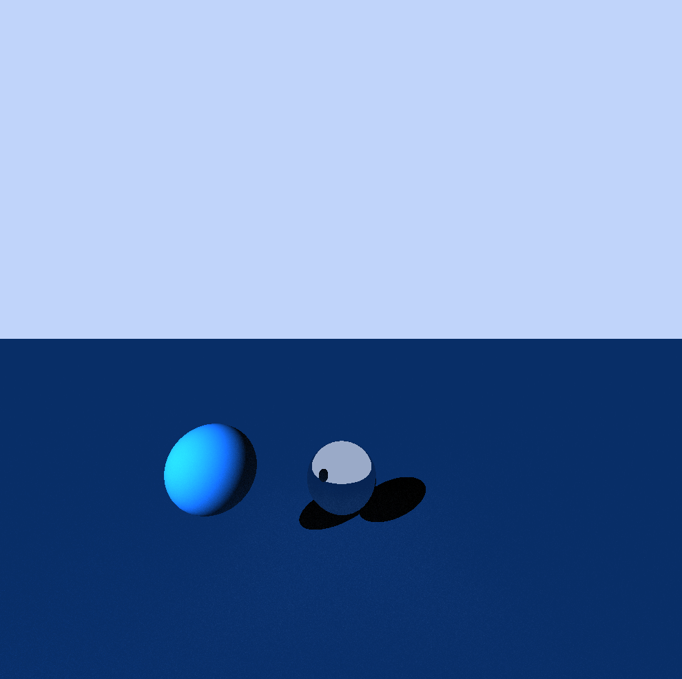

# turbocow

Mooooooo!

## Features

- plugin system based on dll/so files.
- PPM - P3 read/write
- BMP - v4/v5 read and write for 16/24/32 bit. Transparency support.
- GIF - 87a/89a read and write. Reading animated GIFs is also supported. We use our own implementation of lzw and kmeans for clustering.
- PNG - basic reading support. We have our own implementation of deflate.
- JPEG - reading support (including full subsampling support) - reading 1920x1280 image in around 350ms, writing support (with quantization and Huffman tables used from GIMP, multiple quality levels are supported).

## Examples

